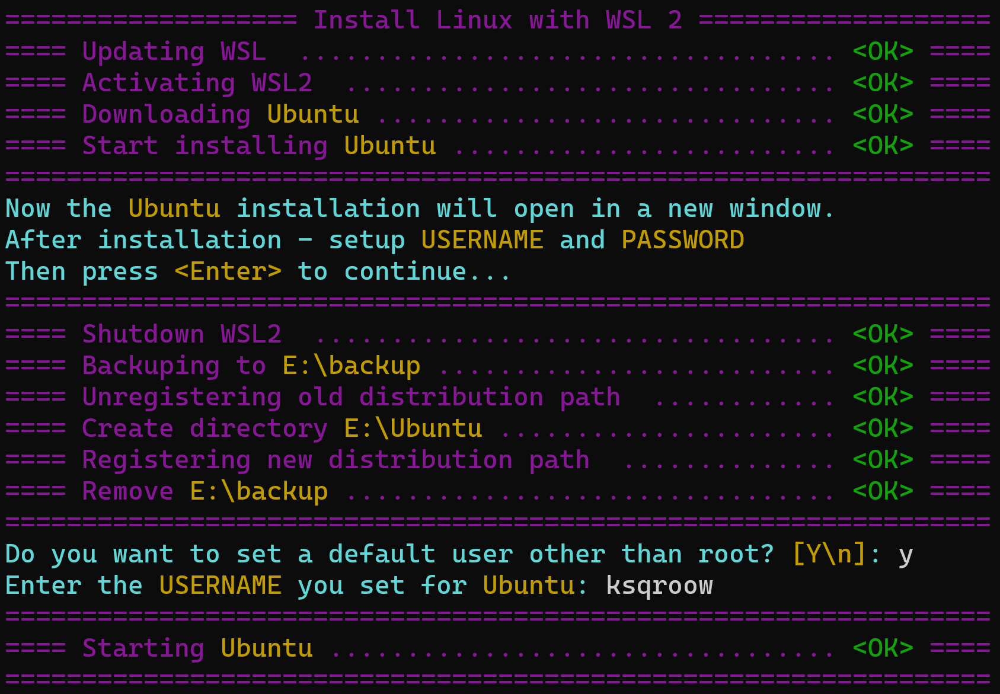

## Clone project

=== "https"

    ```
    git clone https://github.com/KsQRooW/install-wsl.git
    ```

=== "ssh"

    ```
    git@github.com:KsQRooW/install-wsl.git
    ```

=== "GitHub CLI"

    ```
    gh repo clone KsQRooW/install-wsl
    ```
??? note
    If for some reason you cannot use git, then you can simply download the [.zip archive](https://github.com/KsQRooW/Easy-Install-WSL-Linux/archive/refs/heads/main.zip) and unzip it.

## Preparing Windows Components

!!! warning "Before run scripts"
    
    By default, Windows tries to protect you from calling any PowerShell scripts, because Windows ethos doesn't allow normal users to use scripts.

    But in this case, all the functionality is written in PowerShell and you need to run these scripts...
    
    <div class="annotate" markdown>
    1. Therefore, open PowerShell as administrator </br>
    2. Execute `Set-ExecutionPolicy Unrestricted` (1)
    </div>
    
    1. If you are very worried, then after installing the Linux distribution (after calling `install_linux_wsl.ps1`), you can roll back the `ExecutionPolicy` on your system.
        1. Open PowerShell as administrator
        2. Execute `Set-ExecutionPolicy Default`

```powershell
.\install-wsl\src\prepare_win_components.ps1  # (1)!
```

1. This PowerShell script will activate [WSL](https://learn.microsoft.com/en-us/windows/wsl/) and [Virtual Machine Platform](https://support.microsoft.com/en-us/windows/enable-virtualization-on-windows-11-pcs-c5578302-6e43-4b4b-a449-8ced115f58e1)

??? example "Example output after running prepare_win_components.ps1"
    
    { align=left }

## Installing Linux

```powershell title="Installing Ubuntu in directory E:\Ubuntu"
.\install-wsl\src\install_linux_wsl.ps1 -Path E:\Ubuntu -Dist Ubuntu
```

| Param                   |      Required      |     Default      |                Description |
|-------------------------|:------------------:|:----------------:|---------------------------:|
| `Path`/`InstallPath`    |  :material-check:  | :material-close: |  _Linux installation path_ |
| `Dist`/`Distribution`   |  :material-close:  |      Ubuntu      |        _Distribution name_ |

!!! warning "Valid values for `Dist`/`Distribution`"

    `Ubuntu`, `Ubuntu-18.04`, `Ubuntu-20.04`, `Ubuntu-22.04`, `Debian`, `kali-linux`, `OracleLinux_7_9`, `OracleLinux_8_7`, `OracleLinux_9_1`, `openSUSE-Leap-15.5`, `SUSE-Linux-Enterprise-Server-15-SP4`, `SUSE-Linux-Enterprise-15-SP5`, `openSUSE-Tumbleweed`

### Downloading and Installing

!!! note

    In general, everything that will be described below will only tell you what the script does. If you are a confident person, then you don’t need to read further, just [run the script](#installing-linux).

First of all, the script will download the selected Linux distribution and begin installing it. 

Do not worry! 

You will definitely notice the installation in a separate window, and you will know exactly where you need to enter the _username_ and _password_.

??? example "Example of the 1-st part of the output after running install_linux_wsl.ps1"
    
    { align=left }

### Moving

Next, a couple of manipulations will be carried out with your distribution so that it ends up in the directory you need.

??? example "Example of the 2-nd part of the output after running install_linux_wsl.ps1"

    { align=left }

### Starting

!!! note "Bonus for Ubuntu"
    
    If you are installing the `Ubuntu` distribution, then as a bonus (1) you will be asked to set a default user _(so as not to constantly log in as root)_.
    { .annotate }    
    
    1. In fact, at the moment the default custom setting only works correctly for the Ubuntu distribution.
    
    Of course, you should enter the user that was created when installing the distribution.


And finally, your distribution will be launched.

My pleasure.

??? example "Example of the final part of the output after running install_linux_wsl.ps1"

    { align=left }

??? example "Example of the full output after running install_linux_wsl.ps1"

    { align=left }